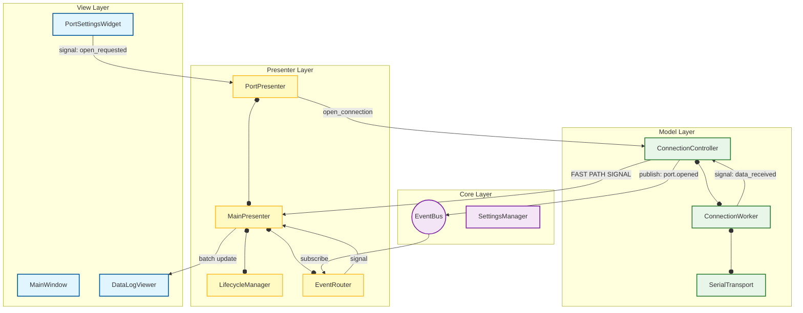

# SerialTool v1.0

**최종 업데이트**: 2025-12-18

**SerialTool**은 Python과 PyQt5로 개발된 고성능 통신 유틸리티입니다.
**Strict MVP (Model-View-Presenter)** 아키텍처를 기반으로 설계되어 유지보수성과 확장성이 뛰어나며,
 **Fast Path**와 **EventBus**를 결합하여 2MB/s 이상의 고속 데이터 환경에서도 안정적인 성능을 제공합니다.

---

## 1. 주요 기능 (Key Features)

### 1.1 핵심 기능

* **멀티 프로토콜(시리얼, SPI, I2C) 지원**: 탭 인터페이스로 여러 프로토콜(시리얼, SPI, I2C) 포트 동시 제어 (최대 16개)
* **고성능 데이터 처리**:
  * **Fast Path 아키텍처**: 대량의 수신 데이터를 EventBus를 거치지 않고 직접 전달하여 오버헤드 최소화
  * **UI Throttling**: 30ms 주기로 UI 업데이트를 배칭(Batching)하여 CPU 점유율 최적화
  * **고속 I/O**: RingBuffer 및 Non-blocking I/O 적용
* **데이터 무결성 및 안정성**:
  * **설정 검증 및 마이그레이션**: JSON Schema를 통한 무결성 검사 및 버전 관리를 통한 설정 자동 마이그레이션 지원
  * **경합 조건 방지**: 파일 전송 중 포트 강제 종료 시 스레드 안전 종료 보장
  * **전역 에러 핸들링**: 메인 및 워커 스레드의 예외를 통합 포착하여 안정성 확보
* **송신**:
  * HEX/ASCII 모드
  * Prefix/Suffix
  * 여러 줄 입력 지원 (라인 번호 표시, Ctrl+Enter 전송)
  * **파일 전송**: Backpressure(역압) 제어를 통한 대용량 파일 전송 (진행률/속도/ETA 표시)
  * **Local Echo**: 송신 데이터 실시간 표시
  * **Broadcast**: 연결된 모든 포트에 동시 명령 전송 (매크로/수동)
  * **히스토리 관리**: 최근 전송 명령어 저장 및 탐색
* **매크로 자동화**:
  * 여러 Command를 리스트로 관리
  * 순차 명령 실행 (Expect 응답 대기 지원)
  * Repeat 및 Delay 설정
  * 스크립트 저장 및 불러오기 (JSON 형식)
* **수신 및 로깅**:
  * HEX/ASCII 모드 및 Newline 처리 옵션 (Raw, LF, CR, CRLF)
  * Tx/Rx 바이트 카운트 및 실시간 속도 모니터링
  * 색상 규칙 기반 로그 강조 (OK=녹색, ERROR=빨강) 및 정규식 검색
  * **스마트 헥사 덤프**: `.bin`(Raw), `.txt`(Hex Dump), `.pcap`(Wireshark) 포맷 저장 지원
  * **전이중 레코딩**: 송/수신 데이터를 모두 기록

### 1.2 UI/UX 특징

* **현대적 인터페이스**:
  * 다크/라이트 테마 전환 및 **하이브리드 색상 매핑** (테마별 최적 색상 자동 보정)
  * 듀얼 폰트 시스템 (Proportional/Fixed)
  * SVG 기반 테마 적응형 아이콘
  * 컴팩트한 2줄 포트 설정 레이아웃
  * 3단계 Select All 체크박스
  * PortState Enum 기반 연결 상태 표시
* **사용성 및 동기화**:
  * **UI 상태 동기화**: 포트 연결 상태에 따라 제어 패널 활성화/비활성화 및 설정 잠금 처리
  * 전역 단축키 지원 (F2: 연결, F3: 해제, F5: 클리어)
  * 설정 자동 저장 (창 크기, 테마, 폰트, 히스토리)
  * 견고한 폴백 메커니즘 (설정 파일 누락 시 복구)

### 1.3 다국어 지원

* **한국어/영어** 실시간 전환
* CommentJSON 기반 번역 관리 및 언어 키 자동 추출 도구 제공

---

## 2. 설치 및 실행 가이드

### 2.1 요구 사항 (Requirements)

* Python 3.10+
* PyQt5, pyserial, commentjson, jsonschema

### 2.2 설치 방법 (Installation)

```bash
# 1. 저장소 클론
git clone https://github.com/yourusername/SerialTool.git
cd SerialTool

# 2. 가상 환경 생성 (권장)
python -m venv .venv

# 3. 가상 환경 활성화
# Windows:
.venv\Scripts\activate
# Linux/Mac:
source .venv/bin/activate

# 4. 패키지 설치
pip install -r requirements.txt
```

### 2.3 실행 (Execution)

```bash
# 가상 환경 활성화 후
python main.py
```

---

## 3. 프로젝트 구조 (Project Structure)

본 프로젝트는 역할과 책임에 따라 엄격하게 디렉토리가 구분되어 있습니다.

```
serial_tool/
├── main.py                             # 애플리케이션 진입점 (Manager 초기화)
├── requirements.txt                    # 의존성 목록
│
├── common/                             # 공통 데이터 (의존성 최하위)
│   ├── app_info.py                     # 애플리케이션 버전 정보
│   ├── constants.py                    # 전역 상수, EventTopics, ConfigKeys
│   ├── dtos.py                         # DTO (PortConfig, ManualCommand, ColorRule 등)
│   └── enums.py                        # 열거형 (PortState, ParserType, LogFormat)
│
├── core/                               # 인프라 및 유틸리티
│   ├── transport/
│   │   ├── base_transport.py           # 하드웨어 통신 추상화 인터페이스
│   │   └── serial_transport.py         # PySerial 구현체
│   │
│   ├── command_processor.py            # Command 전처리 (Prefix/Suffix/Hex)
│   ├── data_logger.py                  # Raw/Hex/Pcap 데이터 로깅
│   ├── error_handler.py                # 전역 예외 처리 (GlobalErrorHandler)
│   ├── event_bus.py                    # Pub/Sub 이벤트 버스 (와일드카드 지원)
│   ├── logger.py                       # 시스템 로거 (Singleton)
│   ├── resource_path.py                # 리소스 경로 관리
│   ├── settings_manager.py             # 설정 관리 (JSON Schema 검증 및 마이그레이션)
│   ├── settings_schema.py              # 설정 스키마 정의
│   └── structures.py                   # RingBuffer, ThreadSafeQueue
│
├── model/                              # [Model] 비즈니스 로직 및 상태
│   ├── connection_controller.py        # 연결 제어, Fast Path 시그널링
│   ├── connection_manager.py           # 연결 인스턴스 관리
│   ├── connection_worker.py            # I/O 워커 스레드 (Batch Processing)
│   ├── file_transfer_service.py        # 파일 전송 엔진 (Backpressure)
│   ├── macro_runner.py                 # 매크로 엔진 (Broadcast/Expect)
│   ├── packet_parser.py                # 패킷 파싱 및 ExpectMatcher
│   └── port_scanner.py                 # 포트 스캔 엔진
│
├── presenter/                          # [Presenter] UI 로직 및 중재자
│   ├── data_handler.py                 # 데이터 처리 및 UI 업데이트
│   ├── event_router.py                 # EventBus -> PyQt Signal 변환
│   ├── file_presenter.py               # 파일 전송 로직 제어
│   ├── lifecycle_manager.py            # 앱 초기화 및 종료 생명주기 관리
│   ├── macro_presenter.py              # 매크로 로직 제어
│   ├── main_presenter.py               # 메인 로직, UI Throttling, Fast Path 처리
│   ├── manual_control_presenter.py     # 수동 제어 로직
│   ├── packet_presenter.py             # 패킷 뷰 로직
│   └── port_presenter.py               # 포트 설정 로직
│
├── view/                               # [View] 사용자 인터페이스 (Passive View)
│   ├── main_window.py                  # 메인 윈도우 셸
│   ├── custom_qt/                      # 커스텀 위젯 (SmartListView, SmartNumberEdit)
│   ├── dialogs/                        # 대화상자 (Preferences, About, FileTransfer)
│   ├── managers/                       # View 헬퍼 (Theme, Lang, Color)
│   ├── services/                       # View 서비스 (ColorService)
│   ├── panels/                         # 패널 (PortPanel, MacroPanel 등)
│   ├── sections/                       # 섹션 (LeftSection, RightSection)
│   └── widgets/                        # 위젯 (DataLog, ManualControl 등)
│
├── resources/                          # 리소스 파일
│   ├── languages/                      # json 언어 파일
│   ├── configs/                        # 기본 설정 파일 (settings.json, color_rules.json)
│   ├── icons/                          # SVG 아이콘
│   └── themes/                         # QSS 스타일시트
│
└── tests/                              # 테스트 코드
    ├── test_model.py                   # 모델 로직 테스트
    ├── test_presenter_init.py          # 프레젠터 초기화 테스트
    └── ...
```

---

## 4. 아키텍처 (Architecture)

### 4.1 MVP 패턴 & 데이터 흐름 (Data Flow)

본 프로젝트는 **Strict MVP** 패턴을 준수합니다. View와 Model은 서로 직접 통신하지 않으며, **DTO**와 **EventBus**를 통해 결합도를 낮춥니다. 단, 고속 데이터 처리를 위해 **Fast Path**를 예외적으로 허용합니다.

```
┌─────────────┐  (DTO)   ┌────────────────┐  (DTO)   ┌──────────────┐
│    View     │─────────►│    Presenter   │─────────►│     Model    │
│ (Passive)   │          │    (Logic)     │          │ (Biz/State)  │
└─────────────┘◄─────────└───────┬────────┘◄─────────└──────┬───────┘
       ▲                         │                          │
       │ (UI Update via          │                          │ (EventBus Publish)
       │  Interface Methods)     │                          │
       │                         │ (Signals)                ▼
┌──────┴───────┐                 │                 ┌────────────────┐
│ EventRouter  │◄────────────────┴─────────────────┤    EventBus    │
└──────────────┘                                   └────────────────┘
```

### 4.2 고속 데이터 처리 경로 (Fast Path Architecture)

데이터 수신 시 오버헤드를 줄이기 위해 EventBus를 우회하는 경로를 사용합니다.

```
[Hardware]
    │
    ▼
[SerialTransport]
    │ (Raw Bytes)
    ▼
[ConnectionWorker] ─── (Batch Processing)
    │
    ▼ (Signal)
[ConnectionController] ──────────────────────────────────┐
    │                                                    │
    │ (1. Slow Path: State Change/Log)                   │ (2. Fast Path: Raw Data)
    ▼                                                    │
[EventBus] ──► [Logger/Plugins]                          │
                                                         ▼
                                                 [MainPresenter]
                                                         │
                                                         │ (3. UI Throttling: 30ms Buffer)
                                                         ▼
                                                 [DataLogWidget]
```

### 4.3 계층 구조 다이어그램

```
┌─────────────────────────────────────────────────────────────────────────────────────────┐
│                                       VIEW LAYER                                        │
│  ┌───────────────────────┐   ┌───────────────────────────┐   ┌───────────────────────┐  │
│  │      MainWindow       │   │      PortSettingsWidget   │   │     RxLogWidget       │  │
│  └───────────┬───────────┘   └──────────────┬────────────┘   └───────────▲───────────┘  │
│              │ (Owns)                       │ (Signal: Connect)          │ (Update)     │
└──────────────┼──────────────────────────────┼────────────────────────────┼──────────────┘
               │                              │                            │
               ▼                              ▼                            │
┌─────────────────────────────────────────────────────────────────────────────────────────┐
│                                    PRESENTER LAYER                                      │
│                                                                                         │
│  ┌───────────────────────────────────────────────────────────────────────────────────┐  │
│  │                                   MainPresenter                                   │  │
│  │                                (with LifecycleManager)                            │  │
│  │ ┌───────────────┐  ┌───────────────┐  ┌───────────────┐  ┌─────────────────────┐  │  │
│  │ │ PortPresenter │  │MacroPresenter │  │ FilePresenter │  │     EventRouter     │  │  │
│  │ └───────┬───────┘  └───────┬───────┘  └───────┬───────┘  └──────────▲──────────┘  │  │
│  └─────────┼──────────────────┼──────────────────┼─────────────────────┼─────────────┘  │
└────────────┼──────────────────┼──────────────────┼─────────────────────┼────────────────┘
             │ (Method Call)    │ (Method Call)    │ (Method Call)       │ (Signals)
             ▼                  ▼                  ▼                     │
┌────────────────────────────────────────────────────────────────────────┼────────────────┐
│                                    MODEL LAYER                         │                │
│                                                                        │                │
│  ┌──────────────────┐   ┌──────────────────┐   ┌───────────────────┐   │                │
│  │  PortController  │   │   MacroRunner    │   │FileTransferService│   │                │
│  │ (Manages Ports)  │   │    (QThread)     │   │   (QRunnable)     │   │                │
│  └─────────┬────────┘   └────────┬─────────┘   └─────────┬─────────┘   │                │
│            │ (Owns)              │ (Publish)             │ (Publish)   │                │
│            ▼                     │                       │             │                │
│  ┌──────────────────┐            │                       │             │                │
│  │ ConnectionWorker │            │                       │             │                │
│  │    (QThread)     │────────────┼───────────────────────┼─────────────┘                │
│  └──────────────────┘            │                       │                              │
└──────────────────────────────────┼───────────────────────┼──────────────────────────────┘
                                   │                       │
                                   ▼                       ▼
┌─────────────────────────────────────────────────────────────────────────────────────────┐
│                                     CORE LAYER                                          │
│                                                                                         │
│           ┌─────────────────────────────────────────────────────────────┐               │
│           │                          EventBus                           │               │
│           │  (Publish / Subscribe Mechanism for Decoupling Layers)      │               │
│           └──────┬───────────────────────┬──────────────────────────────┘               │
│                  │ (Subscribe)           │ (Subscribe)                                  │
│                  ▼                       ▼                                              │
│        ┌──────────────────┐    ┌──────────────────┐                                     │
│        │    DataLogger    │    │ SettingsManager  │                                     │
│        │  (Raw/Hex/Pcap)  │    │   (Config I/O)   │                                     │
│        └──────────────────┘    └──────────────────┘                                     │
└─────────────────────────────────────────────────────────────────────────────────────────┘
```

### 4.4 컴포넌트 관계도 (Component Diagram)



---

## 5. 데이터 흐름 시나리오 (Data Flow Scenarios)

### A. 포트 연결 및 데이터 수신 (Fast Path RX Flow)
>
> **핵심**: `Fast Path`와 `UI Throttling`을 통한 고성능 처리

1. **User**: `PortSettingsWidget`에서 'Connect' 버튼 클릭.
2. **View**: `port_open_requested(config)` 시그널 발생 (DTO 사용).
3. **Presenter**: `PortPresenter`가 시그널을 수신하고 `PortController.open_connection(config)` 호출.
4. **Model**: `PortController`가 `SerialTransport`와 `ConnectionWorker` 생성 및 시작.
5. **Worker**: 백그라운드 스레드에서 Non-blocking 읽기 수행.
6. **Fast Path**: 데이터 수신 시 `ConnectionController` -> `MainPresenter`로 직접 시그널(`data_received`) 전달 (EventBus 우회).
7. **Throttling**: `MainPresenter`는 데이터를 내부 버퍼(`_rx_buffer`)에 쌓고, `QTimer`에 의해 30ms마다 `DataLogWidget`으로 일괄 전송.
8. **Logging**: 파일 로깅은 지연 없이 즉시 수행.

### B. 수동 Command 전송 (Manual TX Flow)
>
> **핵심**: Presenter에서의 비즈니스 로직(Prefix/Suffix) 처리

1. **User**: `ManualCtrlWidget`에서 Command 입력 후 'Send' 클릭.
2. **View**: `send_requested` 시그널 발생 (DTO `ManualCommand` 전달).
3. **Presenter**: `ManualControlPresenter`가 `SettingsManager`를 조회하여 Prefix/Suffix 및 Hex 변환 수행.
4. **Model**: `PortController.send_data()` 호출.
5. **Feedback**: 전송된 데이터는 `Local Echo` 옵션에 따라 View에 표시됨.

### C. 매크로 자동화 및 브로드캐스트 (Automation Flow)
>
> **핵심**: `QThread` 기반 정밀 타이밍 및 `Broadcast` 전송

1. **User**: `MacroCtrlWidget`에서 'Repeat Start' 클릭 (Broadcast 옵션 체크 가능).
2. **Presenter**: `MacroPresenter`가 `MacroRunner`에 `MacroEntry` 리스트 로드 및 시작 명령.
3. **Model (`MacroRunner`)**:
    * `QThread` 내부 루프 시작.
    * **Broadcast**: `is_broadcast` 플래그가 켜져 있으면 `PortController.send_data_to_broadcasting()` 호출.
    * **Delay**: 정밀 타이밍을 위해 `QWaitCondition.wait()` 사용.
4. **Completion**: 루프 종료 시 `macro_finished` 이벤트 발생.

### D. 파일 전송 (File Transfer Flow)
>
> **핵심**: `Backpressure` 제어 및 스레드 풀 사용

1. **User**: `ManualCtrlWidget` 파일 탭에서 'Send File' 클릭.
2. **Presenter**: `FilePresenter`가 `FileTransferService`(`QRunnable`)을 생성하고 `QThreadPool`에서 실행.
3. **Model (`FileTransferService`)**:
    * 파일을 Chunk 단위로 읽음.
    * **Backpressure**: 송신 큐(`TX Queue`) 크기를 모니터링하여 오버플로우 방지 (Flow Control).
    * **Race Condition 방지**: 시작 시 Controller에 등록, 종료 시 해제.
4. **Update**: 진행률(`progress`) 이벤트를 `EventBus`로 발행 → `FileProgressWidget` 갱신.

---

## 6. 개발 가이드 (Development Guide)

### 6.1 문서 참조

| 문서 | 목적 | 위치 |
|------|------|------|
| Implementation Specification | 전체 설계 및 명세 | `doc/Implementation_Specification.md` |
| View 구현 계획 | View 계층 구현 가이드 | `view/doc/implementation_plan.md` |
| 코딩 규칙 | 코드 스타일 | `guide/code_style_guide.md` |
| 명명 규칙 | 코드/언어 키 네이밍 | `guide/naming_convention.md` |
| 주석 가이드 | 주석/Docstring 작성법 | `guide/comment_guide.md` |
| Git 가이드 | 커밋/PR/이슈 규칙 | `guide/git_guide.md` |
| 변경 이력 | 세션별 변경 사항 | `doc/changelog.md` |
| 세션 요약 | 2025-12-18 작업 요약 | `doc/session_summary_20251218.md` |

### 6.2 코딩 컨벤션

* **명명 규칙**: 클래스(`PascalCase`), 함수/변수(`snake_case`), 상수(`UPPER_CASE`).
* **타입 힌트**: 모든 함수 시그니처에 Type Hint 필수 적용.
* **DTO 사용**: 계층 간 데이터 전달 시 `dict` 대신 `common/dtos.py`의 객체 사용.

### 6.3 코드 스타일

* **PEP 8** 준수
* **한국어** 주석 및 Docstring
* **타입 힌트** 필수
* **MVP 패턴** 준수 (View는 시그널만 emit)

### 6.4 네이밍 규칙 (Naming Convention)

* **클래스**: `PascalCase` (e.g., `DataLogWidget`)
* **함수/변수**: `snake_case` (e.g., `connect_port`)
* **언어 키**: `[context]_[type]_[name]` (e.g., `port_btn_connect`)
* **DTO**: `PascalCase` (e.g., `ManualCommand`)

### 6.5 설정 관리

* 설정 파일은 `config/settings.json`에 저장됩니다.
* `SettingsManager`는 로드 시 `jsonschema`를 통해 무결성을 검증하며, 실패 시 안전한 기본값(Fallback)으로 복구합니다.

#### 설정 구조

**논리적 그룹 기반** (`config/settings.json`):

```json
{
  "serial": { "baudrate": 115200, ... },
  "command": { "prefix": "AT", "suffix": "\r\n" },
  "logging": { "log_path": "logs/", ... },
  "ui": { "theme": "dark", "font": {...} }
}
```

### 6.6 Git 버전 관리

* 본 프로젝트는 **Git을 통한 지속적인 백업**을 권장합니다:
* 모든 메시지는 **한국어**로 작성합니다.

```bash
# 커밋 메시지 형식 (한국어)
Feat: 기능 추가
Fix: 버그 수정
Docs: 문서 수정
Refactor: 리팩토링
Style: 스타일 변경
```

#### 브랜치 전략

* `main`: 안정 버전
* `feature/기능명`: 개발 브랜치

#### 권장 사항

* 기능 단위로 자주 커밋 (최소 하루 1회)
* 세션 종료 시 `doc/session_summary_YYYYMMDD.md` 작성

---

## 7. 도구 및 테스트 (Tools & Tests)

### 7.1 유틸리티 도구

```bash
# 소스 코드에서 언어 키 추출 및 JSON 업데이트
python tools/manage_lang_keys.py extract

# 누락되거나 사용되지 않는 언어 키 검사
python tools/manage_lang_keys.py check
```

### 7.2 테스트 실행

```bash
# 전체 테스트 실행
pytest

# 특정 모듈 테스트
pytest tests/test_model.py

# 상세 출력 모드
pytest -v -s
```